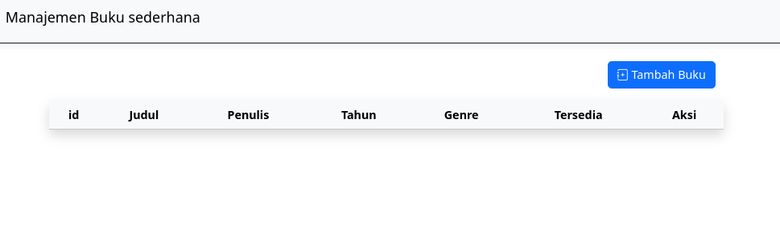
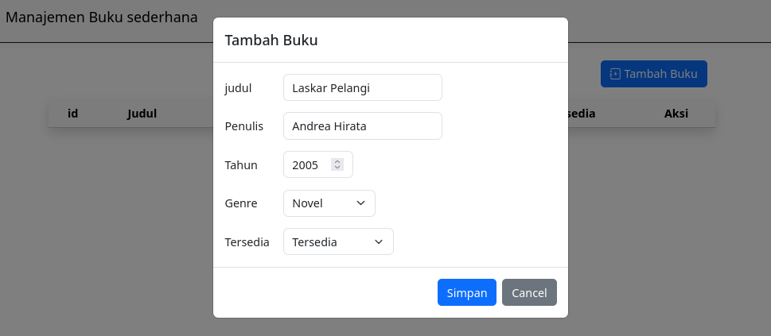
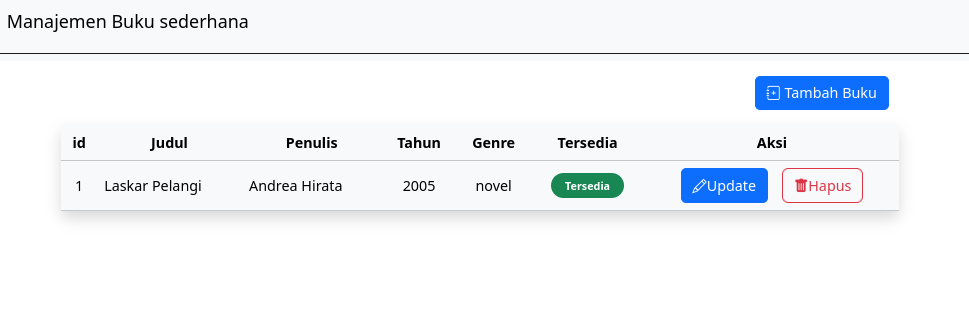
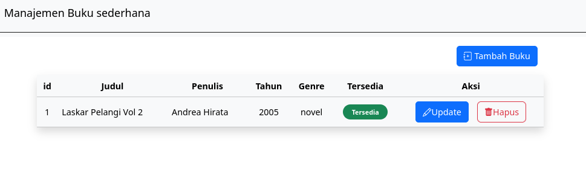
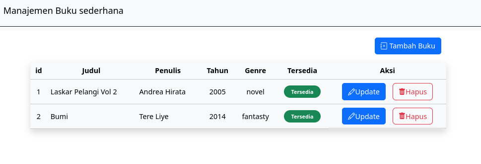
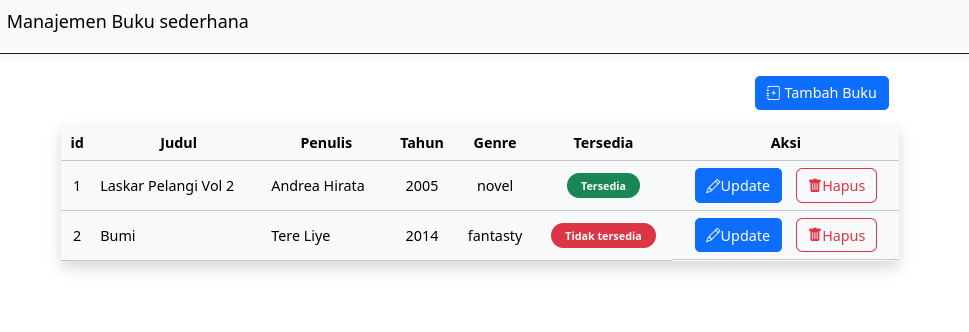
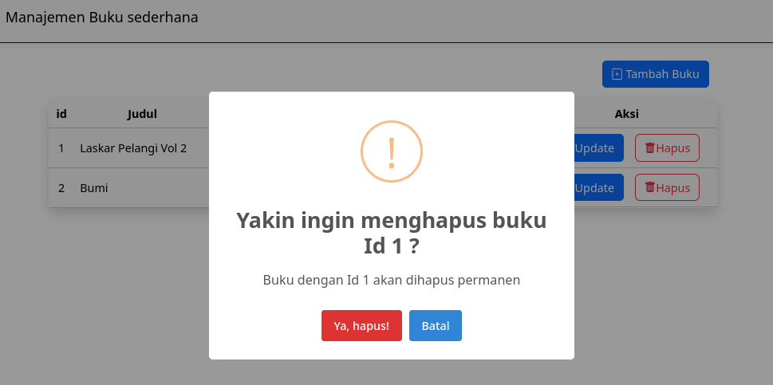
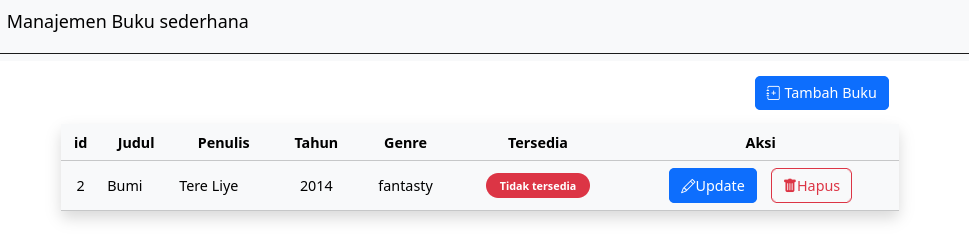
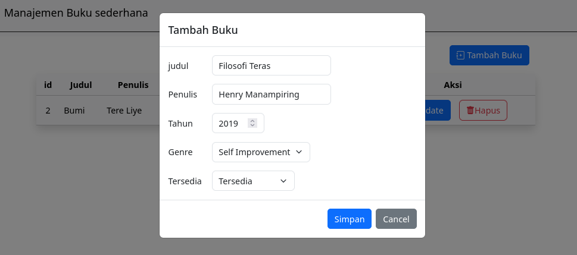
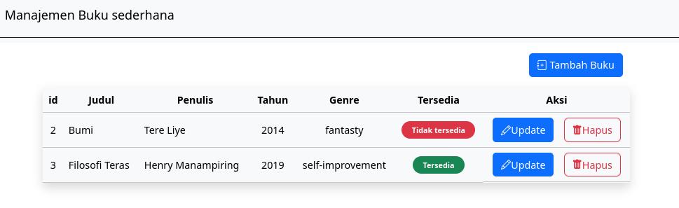

## Manajemen Buku API

Endpoint Manajemen buku sederhana menggunakan FastAPI, tanpa memakai database, data disimpan didalam python list.

## Topik

 - FastAPI
 - Path / Query Parameters
 - Pydantic BaseModel
 - Request Body
 - In-Memory Data (Python List)
 - Filtering dan CRUD
 - HTTPException
 - jsonable_encoder
 - JSONResponse
 - Non-Database

## Endpoints

| Method | Endpoint | Description |
|---|---|---|
| GET | `/buku` | Mendapatkan semua buku |
| GET | `/buku?id=&judul=` | Mendapatkan buku berdasarkan ID atau berdasarkan judul dan bisa keduanya dengan Query Parameter |
| GET | `/buku/{id}` | Mendapatkan buku berdasarkan ID |
| POST | `/buku` | Menambahkan buku |
| PUT | `/buku/{id}` | Mengubah buku |
|PATCH | `/buku/{id}` | Update spesifik ke status ketersediaan buku |
| DELETE | `/buku/{id}` | Menghapus buku |

## Cara Clone dan Eksekusi Program

### 1. Clone Repo

```bash
  git clone https://github.com/dams-code/manajemen-buku-api.git
  cd manajemen-buku-api
```

### 2. Membuat Virtual Environment(env)
Jika memakai Windows :
```bash
  python -m venv .venv
  .venv\Scripts\activate
```

Jika memakai Linux / Mac:
```bash
  python3 -m venv .venv
  source .venv/bin/activate
```

### 3. Install dependency

```bash
  pip install "fastapi[standard]"
```

### 4. Eksekusi FastAPI Server

Jika memakai UV:
```bash
  uv run fastapi dev main.py
```
Jika memakai non-UV:
```bash
fastapi dev main.py
```

### 5. Cek endpoint dan uji coba endpoint di Swagger UI
```bash
  http://127.0.0.1:8000/docs#/
```

### 6. Test di tampilan frontend (mount html)

karena lokasi middleware untuk mount index.htmlnya diset ke "/" untuk akses ke local pakai / diakhir port.

```bash
  http://127.0.0.1:8000/
```

## Tech Stack

### Backend


### Frontend


<div align="center">

  <table border="0" style="border-collapse: collapse; border: none;">
    <tr>
      <td align="center" style="padding: 15px; border: none;">
        
        <p align="center">
          <sub><b>Gambar 1:</b> Tampilan Awal Buku</sub>
        </p>
      </td>
    </tr>
  </table>

  <br>

  <table border="0" style="border-collapse: collapse; border: none;">
    <tr>
      <td align="center" style="padding: 15px; border: none;">
        
        <p align="center">
          <sub><b>Gambar 2:</b> Tambah Buku Awal</sub>
        </p>
      </td>
    </tr>
  </table>

  <table border="0" style="border-collapse: collapse; border: none;">
    <tr>
      <td align="center" style="padding: 15px; border: none;">
        
        <p align="center">
          <sub><b>Gambar 3:</b> Hasil Tambah Buku Awal</sub>
        </p>
      </td>
    </tr>
  </table>

  <table border="0" style="border-collapse: collapse; border: none;">
    <tr>
      <td align="center" style="padding: 15px; border: none;">
        
        <p align="center">
          <sub><b>Gambar 4:</b> Update Buku Awal</sub>
        </p>
      </td>
    </tr>
  </table>

  <table border="0" style="border-collapse: collapse; border: none;">
    <tr>
      <td align="center" style="padding: 15px; border: none;">
        
        <p align="center">
          <sub><b>Gambar 5:</b> Hasil Update Buku Awal</sub>
        </p>
      </td>
    </tr>
  </table>

  <table border="0" style="border-collapse: collapse; border: none;">
    <tr>
      <td align="center" style="padding: 15px; border: none;">
        
        <p align="center">
          <sub><b>Gambar 6:</b> Hasil Tambah Buku Kedua</sub>
        </p>
      </td>
    </tr>
  </table>

  <table border="0" style="border-collapse: collapse; border: none;">
    <tr>
      <td align="center" style="padding: 15px; border: none;">
        
        <p align="center">
          <sub><b>Gambar 7:</b> Hasil Perubahan Status Buku</sub>
        </p>
      </td>
    </tr>
  </table>

  <table border="0" style="border-collapse: collapse; border: none;">
    <tr>
      <td align="center" style="padding: 15px; border: none;">
        
        <p align="center">
          <sub><b>Gambar 8:</b> Menghapus Buku</sub>
        </p>
      </td>
    </tr>
  </table>

  <table border="0" style="border-collapse: collapse; border: none;">
    <tr>
      <td align="center" style="padding: 15px; border: none;">
        
        <p align="center">
          <sub><b>Gambar 8:</b> Setelah Hapus Buku</sub>
        </p>
      </td>
    </tr>
  </table>

  <table border="0" style="border-collapse: collapse; border: none;">
    <tr>
      <td align="center" style="padding: 15px; border: none;">
        
        <p align="center">
          <sub><b>Gambar 8:</b> Tambah Buku Lagi Setelah Hapus Buku</sub>
        </p>
      </td>
    </tr>
  </table>

  <table border="0" style="border-collapse: collapse; border: none;">
    <tr>
      <td align="center" style="padding: 15px; border: none;">
        
        <p align="center">
          <sub><b>Gambar 8:</b> Hasil Tambah Buku Setelah Hapus Buku</sub>
        </p>
      </td>
    </tr>
  </table>

</div>

## Copyright Personal Portfolio
* **Project Owner / Created By:** Damar Djati Wahyu Kemala
* **Study:** FastAPI endpoint CRUD buku sederhana
* **Date Created:** Agustus 2026
* **GitHub Portfolio:** [https://github.com/dams-code](https://github.com/dams-code)
